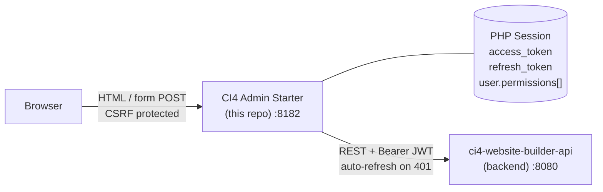

# CI4 Admin Starter

An opinionated **CodeIgniter 4 administrative dashboard template** designed to consume and interact with the [ci4-website-builder-api](https://github.com/yourusername/ci4-website-builder-api) backend API.

## 🎯 Purpose

This is a **server-rendered frontend** (SRF) that provides a complete administrative panel. It does NOT implement business logic or direct database access—it's a client application that orchestrates HTTP requests to a backend API and renders server-side views.

**Architectural Design:**



Tokens live **only** in the server-side PHP session — never in cookies, `localStorage`, or anything reachable from JavaScript. The `ApiClient` library is the single chokepoint for all backend traffic and handles token refresh transparently when the API returns 401.

## 📋 Key Principles

1. **Decoupled Architecture:** Business logic and persistence live in the backend (`ci4-website-builder-api`). This frontend is stateless except for session JWT storage.
2. **Server-Rendered Views:** Uses PHP views with Tailwind CSS and Alpine.js for interactivity. No frontend build pipeline required for production.
3. **Centralized API Communication:** All HTTP requests go through `app/Libraries/ApiClient.php`, which handles token refresh, error handling, and response normalization.
4. **Service Layer Pattern:** Controllers call Services, which use the ApiClient. Keeps code organized and testable.
5. **FormRequest Validation:** Form validation is centralized in `app/Modules/{ModuleName}/Requests/` classes, keeping controllers thin.

## ⚡ Quick Start

For first-time setup, see **[QUICK-START.md](./docs/QUICK-START.md)** for step-by-step instructions.

**TL;DR:**
```bash
# 1. Clone and install
bash install.sh

# 2. Start development servers (two terminals)
php spark serve --port 8182    # Terminal 1
npm run dev:css                # Terminal 2

# 3. Open in browser
# http://localhost:8182
```

Open the admin with `http://localhost:8182`, matching `app.baseURL`.
Do not use `http://127.0.0.1:8182` for the browser session: CodeIgniter CSRF/session
state is host-sensitive, and mixing `127.0.0.1` with `localhost` can produce
`SecurityException #403` on login.

## 📚 Documentation

Complete documentation is available in the **[Documentation Hub](./docs/INDEX.md)**. Key topics:

| Guide | Purpose |
|-------|---------|
| **[Quick Start](./docs/QUICK-START.md)** | First-time setup and verification |
| **[Architecture](./docs/ARCHITECTURE.md)** | System design, ApiClient, security patterns |
| **[Services & Validation](./docs/SERVICES.md)** | Service layer, FormRequest pattern |
| **[Frontend Guide](./docs/FRONTEND.md)** | UI components, Tailwind, Alpine.js |
| **[Testing](./docs/TESTING.md)** | Unit and feature test strategies |
| **[Deployment](./docs/DEPLOYMENT.md)** | Production checklist and configuration |
| **[Troubleshooting](./docs/TROUBLESHOOTING.md)** | Common issues and solutions |
| **[FAQ](./docs/FAQ.md)** | Frequently asked questions |

## 🔐 API Contract & Backend Integration

This template is designed to work seamlessly with [ci4-website-builder-api](https://github.com/yourusername/ci4-website-builder-api). The backend contract is mandatory:

- **API Prefix:** `/api/v1`
- **Authentication:** Bearer JWT with automatic refresh token handling
- **Response Format:** Standard JSON envelope with data, messages, and field errors
- **Headers:** Automatic `X-App-Key` injection for elevated rate limiting (optional)

See **[API Compatibility Guide](./docs/API-COMPATIBILITY.md)** for the complete contract.

## 🧱 Module Scaffolding Scope

`bash bin/make-module.sh <Resource> <Module> <ApiPath>` is a convenience scaffold for new admin modules. It generates a **CRUD shell** aligned with this starter's conventions:

- base controller, service, form requests, routes, language files, views, and test stubs
- wiring against `apiClient` by default, or `domainApiClient` with `--service=domain`
- optional item-level POST actions with repeatable `--action=<verb>` flags for common cases such as `approve`, `publish`, `archive`, `restore`
- a valid starting structure for flat list/show/create/update/delete flows

It is **not** a complete aggregate UI generator. After scaffolding, expect manual work when the module needs:

- custom actions such as `publish`, `archive`, `approve`
- nested resources or child collections
- relation arrays and richer form payloads
- dependent dropdowns / option loaders
- hub file picker or media-management flows
- domain-specific response shaping beyond a flat CRUD table/form

Optional CSV export/import is available as a scaffold extension for admin modules. When enabled, the generator emits the export route and button wired to the current index filters, plus an import flow with row-level validation feedback and a preview/error partial for rejected rows. Treat this as a convenience layer for repetitive admin data loading, not as a substitute for domain-specific ingestion logic.

Use the script to remove boilerplate and establish the module shape. Treat the generated code as the first draft, not the finished admin UX.

## 🏗️ Standard Response Format

The `ApiClient` normalizes all API responses to this structure:

```php
[
    'ok'          => bool,           // true for 2xx, false otherwise
    'status'      => int,            // HTTP status code
    'data'        => array,          // Main payload
    'messages'    => array,          // [success|error messages]
    'fieldErrors' => array,          // Field-level validation errors
    'raw'         => string,         // Original JSON body
]
```

## ✅ Form Validation & Request Layer

All form validation is handled through `app/Modules/{ModuleName}/Requests/*Request.php` classes (e.g. `app/Modules/Auth/Requests/RegisterRequest.php`):

- **rules():** UI-level validation rules (`required`, `valid_email`, `max_length`)
- **payload():** Normalization to API-expected format
- **validate():** Automatic error collection and field mapping
- **No database validation:** Business logic validation belongs in the backend

Example controller usage:
```php
$request = service('formRequest', UserCreateRequest::class, false);
$invalid = $this->validateRequest($request);
if ($invalid !== null) return $invalid;

$response = $this->safeApiCall(
    fn() => $this->userService->create($request->payload())
);
```

See **[Validation Layer Guide](./docs/VALIDATION-LAYER.md)** for detailed patterns.

## 🛠️ Requirements

- **PHP** 8.2 or higher
- **Composer** 2.x
- **Node.js** 20.19+ (or 22.13+, or 24+) — for Tailwind CSS builds
- **PHP Extensions:**
  - `intl` (required)
  - `mbstring` (required)
  - `curl` (recommended)
  - `json` (recommended)

## 📦 Installation

### Option 1: Automated Setup (Recommended)

```bash
bash install.sh
```

This script handles:
- Environment file creation and configuration
- Composer dependencies
- npm dependencies
- Template variable replacement (app name, API URL, etc.)

### Option 2: Manual Setup

```bash
# Install PHP dependencies
composer install

# Install npm dependencies
npm install

# Copy environment template
cp env .env
```

Edit `.env` with your configuration:

```dotenv
# Application
CI_ENVIRONMENT = development
app.baseURL = 'http://localhost:8182/'

# Backend API
apiClient.baseUrl = 'http://localhost:8180'
apiClient.apiPrefix = '/api/v1'

# Optional: Google OAuth (for "Login with Google" button)
GOOGLE_CLIENT_ID = 'your-client-id.apps.googleusercontent.com'

# Optional: File upload limit
FILE_MAX_SIZE = 10485760

# Optional: App API key for elevated rate limiting
# Create via /admin/api-keys or POST /api/v1/api-keys on the backend
# apiClient.appKey = apk_xxxxxxxxxxxxxxxxxxxxxxxxxxxx
```

See **[Quick Start](./docs/QUICK-START.md)** for detailed setup instructions.

## 🚀 Development

Start both servers in separate terminal windows:

**Terminal 1 — PHP Development Server:**
```bash
php spark serve --port 8182
# Application available at http://localhost:8182
```

Use that exact `localhost` URL in the browser. `127.0.0.1` is fine for database
connections, but the admin frontend should use the same host configured in
`app.baseURL`.

**Terminal 2 — Tailwind CSS Watcher:**
```bash
npm run dev:css
# Recompiles CSS on file changes
```

Both must run during development. In production, CSS is pre-compiled.

## ✔️ Quality & Testing

```bash
# Run all tests
composer test

# Run specific test suites
composer test:unit
composer test:feature

# Static analysis (PHPStan)
composer analyse

# Code style check
composer format:check

# Auto-fix code style
composer format

# Full quality check (tests + analysis + style)
composer quality
```

## 📁 Project Structure

```
app/
├── Modules/                    # Feature modules (Auth, Users, Files, etc)
│   ├── Auth/
│   │   ├── Config/Routes.php
│   │   ├── Controllers/
│   │   ├── Requests/
│   │   ├── Services/
│   │   ├── Views/
│   │   └── Language/
│   ├── Users/
│   ├── Files/
│   ├── Dashboard/
│   ├── Profile/
│   ├── Audit/
│   ├── ApiKeys/
│   ├── Metrics/
│   └── Language/
│
├── Filters/                    # Auth, Admin, Locale filters
├── Libraries/                  # ApiClient & custom libraries
├── Helpers/                    # UI & form helpers
├── Config/                     # Framework & application config
├── Language/                   # Global i18n files (fallback)
├── Models/                     # (Unused — all data from API)
└── Traits/                     # Shared traits

docs/
├── INDEX.md             # Documentation hub
├── QUICK-START.md       # Setup guide
├── ARCHITECTURE.md      # System design & ApiClient
├── SERVICES.md          # Service pattern & validation
├── FRONTEND.md          # UI/UX components & patterns
├── TESTING.md           # Test strategies
├── DEPLOYMENT.md        # Production checklist
├── TROUBLESHOOTING.md   # Common issues
└── FAQ.md              # Frequently asked questions

tests/
├── unit/                # Unit tests (libraries, filters, services)
├── feature/             # Feature tests (controller workflows)
└── README.md            # Test documentation
```

## 🛡️ Security

- JWT tokens stored **only in server-side PHP sessions**, never in localStorage or cookies
- CSRF protection enabled by default
- Content Security Policy (CSP) headers configurable
- File uploads validated on size before API submission
- API app key stored in `.env`, never exposed to client-side code
- Never commit `.env` files or hardcode secrets

**Production Security Checklist:**
- ✅ Set `CI_ENVIRONMENT = production`
- ✅ Set `app.forceGlobalSecureRequests = true`
- ✅ Enable `app.CSPEnabled = true`
- ✅ Set `cookie.secure = true`
- ✅ Verify `app.baseURL` uses HTTPS
- ✅ Run `composer install --no-dev --optimize-autoloader`
- ✅ Build CSS: `npm ci && npm run build:css`
- ✅ Ensure `public/` is DocumentRoot
- ✅ Set correct permissions on `writable/`

See **[Deployment Guide](./docs/DEPLOYMENT.md)** for complete checklist.

## 🎯 Template Usage

To create a new project from this template:

1. **Branding:** Update app name and colors in `head.php`
2. **API Configuration:** Set `apiClient.baseUrl` in `.env`
3. **Modules:** Remove unused modules (Audit, ApiKeys, Metrics, Files) from routes and sidebar
4. **Localization:** Keep only needed locales (English/Spanish)
5. **Quality Gates:** Run `composer quality` to ensure standards
6. **Pre-commit Hooks:** Run `npm run prepare` to install git hooks

## 🔗 External Resources

- **[CodeIgniter 4 Documentation](https://codeigniter.com/user_guide/)** — Framework reference
- **[ci4-website-builder-api](https://github.com/yourusername/ci4-website-builder-api)** — Backend API template
- **[Tailwind CSS Docs](https://tailwindcss.com/)** — Utility-first CSS framework
- **[Alpine.js Docs](https://alpinejs.dev/)** — Lightweight JavaScript framework
- **[Lucide Icons](https://lucide.dev/)** — Icon library

## 📝 License

This project is open source. See LICENSE file for details.

## 🤝 Contributing

Contributions are welcome! Please see [CONTRIBUTING.md](./CONTRIBUTING.md) for guidelines.

## ❓ Need Help?

- **First time?** Start with **[QUICK-START.md](./docs/QUICK-START.md)**
- **Something broken?** Check **[TROUBLESHOOTING.md](./docs/TROUBLESHOOTING.md)**
- **Have a question?** See **[FAQ.md](./docs/FAQ.md)**
- **Want to understand the system?** Read **[ARCHITECTURE.md](./docs/ARCHITECTURE.md)**

---

## 🌐 Languages / Idiomas

- **English** — [Documentation](./docs/INDEX.md) (Official)
- **Español** — [Documentación](./docs/es/README.md)

---

**Last Updated:** 2026-05-17  
**Status:** Stable — opinionated, personal stack. No support contract.
